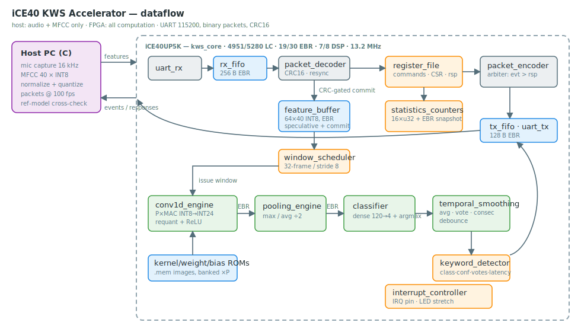

# iCE40 KWS Accelerator

**A streaming TinyML coprocessor for real-time keyword spotting on the
Lattice iCE40UP5K (iCEBreaker v1.1a), built entirely with the open-source
FPGA toolchain.**



The host PC does audio capture and MFCC extraction — nothing else. The FPGA
does **everything** downstream: packet protocol with CRC, circular feature
buffering, autonomous window scheduling, INT8 Conv1D → ReLU → pooling →
dense inference, temporal decision smoothing, and event generation. There is
no request/response inference: the host streams features forever, the FPGA
raises `EVT_KEYWORD` packets only when it detects a keyword.

This is first and foremost a **digital design project** — the neural network
is just the workload. The emphasis is on RTL quality, memory organization,
pipeline design, scheduling, verification and honest engineering tradeoffs
(each one is documented with the alternatives that were rejected and why).

## Highlights

* **Bit-exact verification, one golden model.** A single C reference
  (`host/src/ref_model.c`) specifies every arithmetic and decision step. It
  is compiled into all 13 Verilator benches *and* into the host application,
  which cross-checks live hardware against software on the same feature
  stream (`--check`). Hardware events match the model in class, confidence,
  votes, and frame attribution — exactly, not approximately.
* **Parameterized streaming Conv1D engine**: `PARALLEL` output-channel MAC
  lanes with banked kernel ROMs sharing a single feature fetch; verified at
  P = 1/2/4; 1 MAC/lane/cycle with a 2-stage memory pipeline and no stalls.
* **CRC-gated speculative buffering**: feature payload bytes stream into the
  circular buffer while the packet is still arriving; only a verified CRC
  advances the write pointer. Corrupt packets cost zero cleanup, and
  reception is concurrent with inference by construction.
* **Production-grade link robustness**: resynchronizing parser, inter-byte
  timeout, semantic error responses, fault-injection tests (bit flips,
  garbage, oversized lengths, breaks) all the way up through the full-system
  bench.
* **Real keyword recognition, validated on silicon**: trained on Speech
  Commands v2 through the deployment feature pipeline, thresholds tuned on
  held-out streams, and proven on the live board — real spoken "yes"/"no"
  from the official test split detected over the UART link, every event
  bit-exact against the reference.
* **Fits and closes**: 4607/5280 LC (87 %), 19/30 EBR, 7/8 DSP,
  14.98 MHz worst-case against the 12 MHz clock — with the area/timing
  war stories written up in [docs/performance.md](docs/performance.md).

## Repository layout

```
rtl/           32 SystemVerilog modules (one per file, Verilator -Wall clean)
tb/            13 self-checking Verilator benches + shared harness/BFMs
sim/           regression build system
host/          C application: mic/WAV/synth capture, MFCC, serial, CLI,
               reference model, statistics, config
model/         quantization library + deterministic bring-up weight generator
training/      NumPy training, threshold tuning, INT8 export (offline tooling)
weights/       checked-in TRAINED model artifacts (.mem images, C header,
               self-test stream, provenance JSON)
constraints/   iCEBreaker pin constraints
scripts/       synthesis script
verification/  test plan with requirement traceability
docs/          architecture, protocol, pipeline, FSMs, memory map,
               verification, build, training, performance, future work
.github/       CI: lint, regression, implementation + timing, host, weights
```

## Quick start

```sh
make lint          # Verilator -Wall, zero warnings
make sim           # full regression: 13 benches, bit-exact vs C reference
make bit time      # yosys -> nextpnr -> icepack -> icetime
make host          # host application
make prog          # flash the iCEBreaker
host/build/kws_host --port COM7 --input mic --stats 10
```

Toolchain: [OSS CAD Suite](https://github.com/YosysHQ/oss-cad-suite-build)
+ GCC + make + Python 3. Windows/MSYS2 works identically — see
[docs/build.md](docs/build.md).

The shipped weights are **trained on Google Speech Commands v2** (keywords
"yes"/"no"; 85 % 4-class INT8 accuracy; provenance in
`weights/model_params.json`) with features from the exact deployment MFCC
front end and detection thresholds tuned on held-out streams — validated on
real hardware end to end: 7/8 held-out spoken keywords detected on the live
iCEBreaker with every event bit-exact against the reference model. To
retrain or change keywords: [docs/training.md](docs/training.md).

## Documentation

| | |
|---|---|
| [Architecture & tradeoffs](docs/architecture.md) | [UART protocol](docs/protocol.md) |
| [Pipeline / latency / throughput](docs/pipeline.md) | [FSM reference](docs/fsm.md) |
| [Memory map & layouts](docs/memory_map.md) | [Verification strategy](docs/verification.md) |
| [Test plan (traceability)](verification/testplan.md) | [Build instructions](docs/build.md) |
| [Training & export](docs/training.md) | [Performance report](docs/performance.md) |
| [Future work](docs/future_work.md) | |

## License

MIT — see [LICENSE](LICENSE).
